Oculus Platform
====

앱 생성하기
----
[오큘러스 개발자 사이트](https://dashboard.oculus.com/organization/create)에 접속합니다.<br>
단체 이름을 입력하는 화면이 표시되면 이름을 입력하고 '다음'을 클릭합니다.<br>
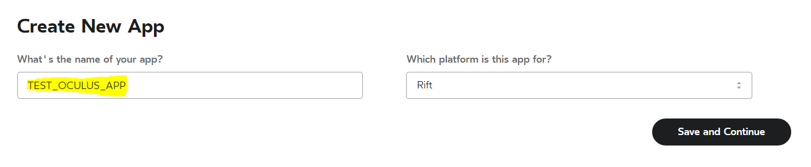
앱 정보를 적절히 입력하여 앱을 생성합니다.<br>
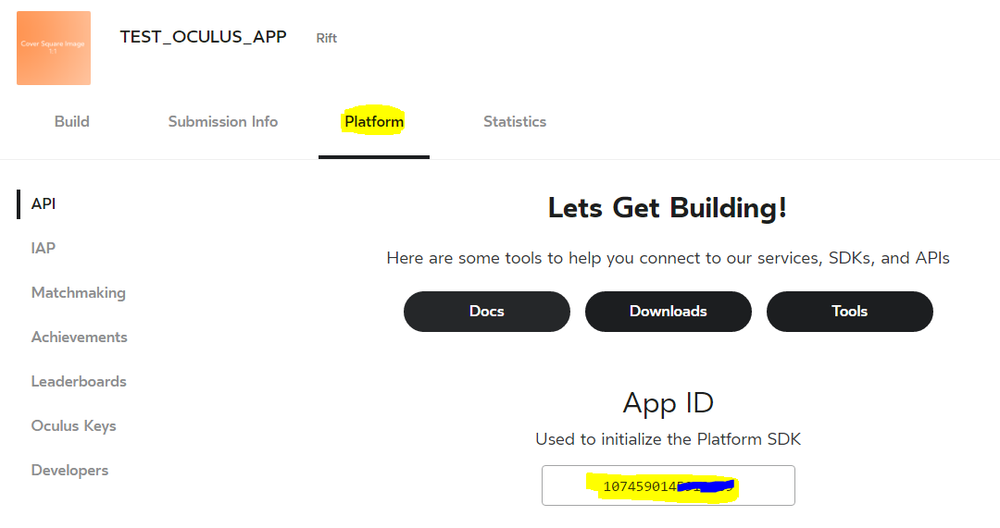
앱 생성이 완료되면 앱 정보 페이지에서 발급된 앱 아이디를 확인할 수 있습니다.

Unity 에서 연동하기
----
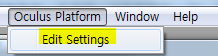<br>
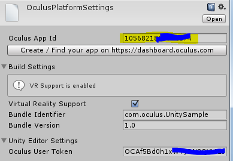<br>

```cs
using Oculus.Platform;

Core.Initialize();

Users.GetLoggedInUser().OnComplete((Message msg) => {
  var user = msg.GetUser();

  // 오큘러스의 유저 식별자
  // ex) 4412314125
  var oculusUniqueID = user.ID.ToString();
  // 오큘러스 유저 아이디
  // ex) pjc8642
  var oculusUserID = user.OculusID();
            
  StartCoroutine(LoadProfileImage(user));
});
```
```cs
public UnityEngine.UI.RawImage profileImage;

// 프로필 이미지를 로드하는 코드
IEnumerator LoadProfileImage(Oculus.Platform.Models.User user)
{
  var www = new WWW(user.ImageURL);

  yield return www;

  profileImage.texture = www.texture;            
}
```

빌드 업로드하기
----
오큘러스 개발자 사이트에 빌드를 업로드하면 등록된 개발자 및 테스터들이 오큘러스 앱을 통해 게임을 다운로드 받을 수 있습니다.<br>
유니티에서 __PC__ 플랫폼을 선택하고 빌드합니다.
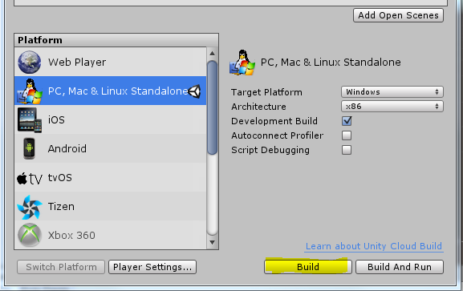<br>
아래와 같이 빌드된 결과물이 출력되면, `Data` 폴더와 `exe` 파일을 압축합니다.<br>
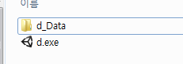<br>
압축한 파일을 오큘러스 개발자 사이트에 업로드합니다.
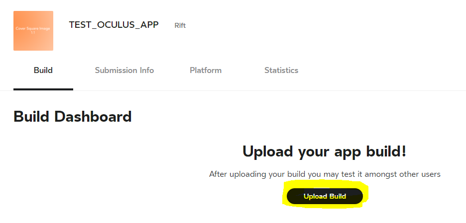<br>
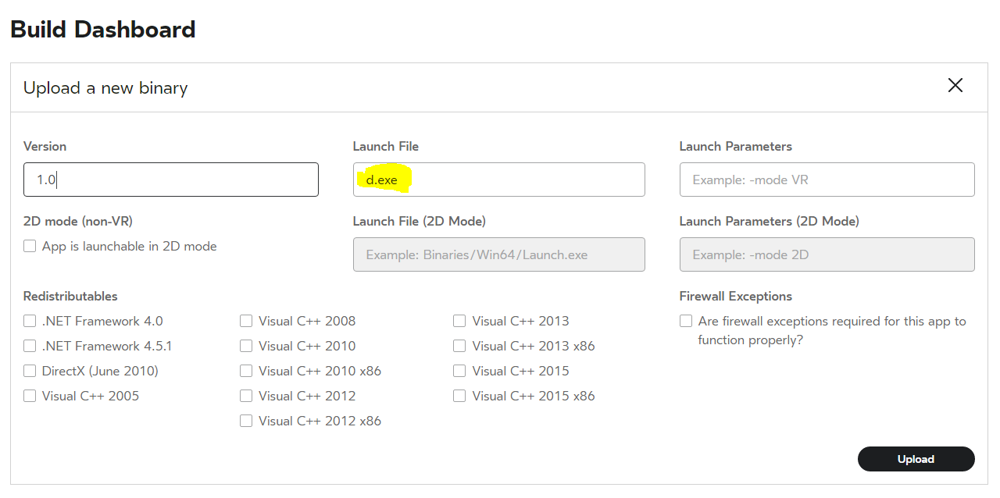<br>
필요에 따라 적절한 정보를 입력합니다.<br>
__Launch File__ 항목은 반드시 게임 실행 파일의 경로를 입력해야 합니다.

앱 테스터 등록하기
----
업로드한 빌드를 다운로드 받을 수 있는 유저들을 등록하는 방법을 알아봅니다.<br>
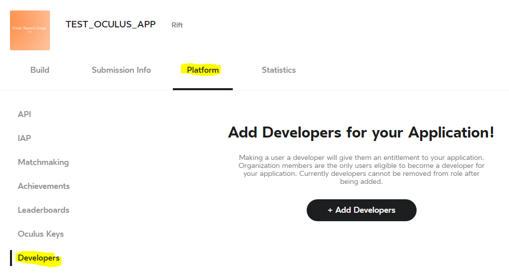<br>
앱 설정 페이지에서 __Platform__ -> __Developers__ 탭에 들어갑니다.<br>
`Add Developers` 버튼을 클릭해 원하는 멤버를 추가합니다.
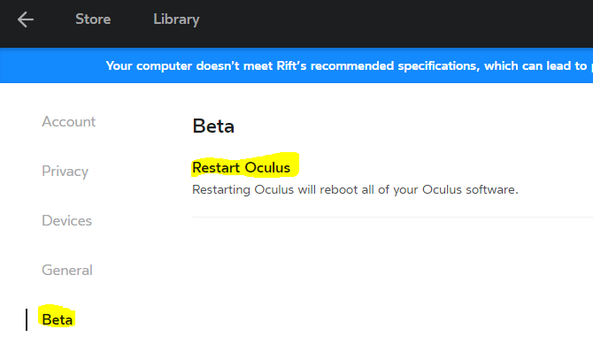<br>
멤버가 추가되면, 해당 유저는 오큘러스 프로그램을 재시작해야합니다.<br>
오큘러스 프로그램의 __Setting__ -> __Beta__ -> __Restart Oculus__ 를 클릭해 오큘러스를 재시작합니다.
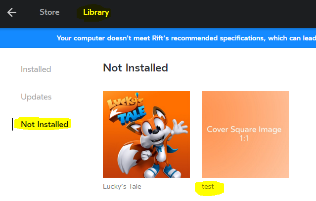<br>
재시작이 완료되면 상단 __Library__ 메뉴에 게임이 표시됩니다.<br>
이제 게임을 다운로드 받고, 오큘러스 프로그램에서 바로 실행시킬 수 있습니다.
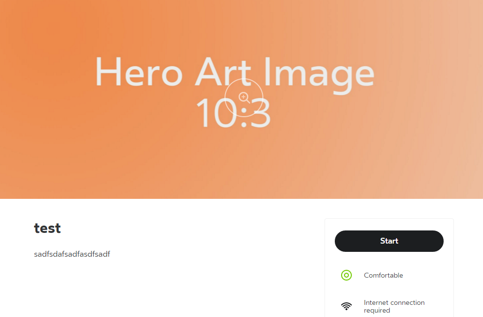<br>
게임 디테일 페이지
